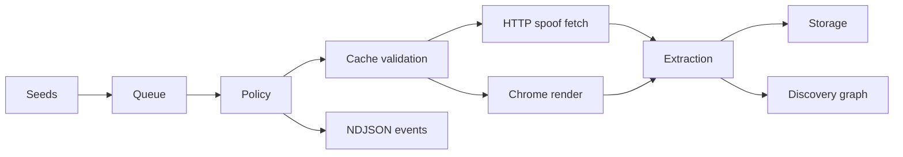

# crawlex

> Stealth crawler with Chrome-aligned HTTP/TLS impersonation, render escalation, persistent queues and NDJSON events.

This repository publishes the `crawlex` CLI, library and JavaScript wrapper. The working directory may still be named `minibrowser`, but the public package and binary surface is `crawlex`.

## Why crawlex

- It starts HTTP-first, then escalates to Chrome rendering only when the selected method or policy needs it.
- It keeps state outside the process through SQLite queues and storage backends, so long crawls survive restarts.
- It emits a stable NDJSON event envelope that SDKs and pipelines can consume without scraping terminal text.
- It adds discovery probes around the main crawl path: robots paths, `/.well-known`, PWA manifests, Wayback, DNS, favicon hashes, peer certs and RDAP.
- It can validate cached pages before reprocessing them, run discovery-only prefetch passes, and score the frontier so high-value links run first.

## Last 24h update

- Releases `1.0.1` through `1.0.4` shipped, including docsify GitHub Pages deployment.
- JS hook bridge support landed in the SDK through `defineHooks()`.
- The event stream gained artifact paths, Web Vitals, fetch timings, crawl attempts and crawl-resolution summaries.
- The HTTP-only mini build was hardened so CDP-only behavior fails cleanly.
- The current tree also documents cache validation, prefetch discovery mode, best-first scoring, external CDP, GPU posture, DOM cleanup and fallback fetch.

## What a run looks like



## First useful command

```bash
cargo run --release -- crawl \
  --seed https://example.com \
  --method auto \
  --queue sqlite --queue-path state/queue.db \
  --storage sqlite --storage-path state/crawl.db \
  --cache-validate \
  --best-first \
  --emit ndjson \
  --explain
```

That gives you a resumable queue, persisted crawl state, machine-readable stdout and human-readable decision traces on stderr.

## Documentation map

- Start with [Installation](/getting-started/installation.md) if you are setting up the binary or wrapper.
- Use [Quick Start](/getting-started/quickstart.md) for common operator flows.
- Read [Architecture](/architecture/00-overview.md) when you need to understand how queueing, rendering, identity and persistence fit together.
- Keep [CLI](/reference/cli.md), [Config JSON](/reference/config.md) and [NDJSON Events](/reference/events.md) open when integrating the tool into automation.
