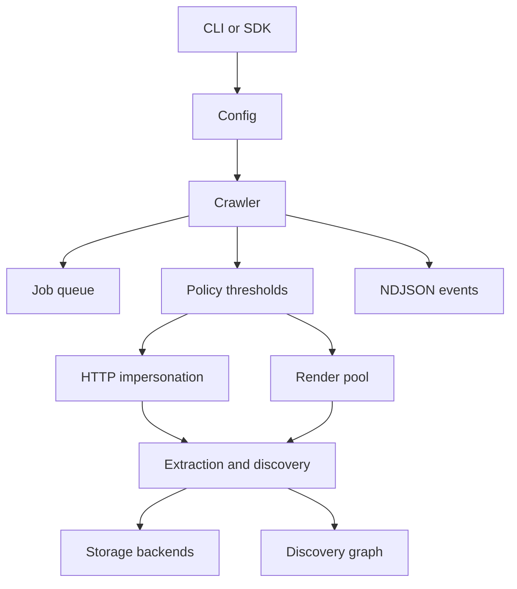

# Architecture Overview

`crawlex` is split into a few explicit runtime layers instead of one monolithic crawler loop.

## Main modules

- `config`: typed runtime configuration and backend selection.
- `crawler`: orchestration layer that wires queue, policy, fetch/render, extraction, storage and event emission.
- `impersonate`: HTTP/TLS path with Chrome-aligned request headers and profile handling.
- `render`: Chrome-backed rendering pool, waits, action scripts and screenshot capture.
- `discovery`: link extraction plus auxiliary probes such as Wayback, DNS, PWA and `/.well-known`.
- `queue`: in-memory or SQLite-backed job scheduling.
- `storage`: memory, SQLite and filesystem persistence.
- `events`: versioned NDJSON event contract.
- `hooks`: runtime interception points; Lua-backed scripts are optional behind the `lua-hooks` feature.
- `proxy`: rotation pool and health-aware proxy selection.

## Control flow

## Design bias

- Default behavior is throughput-first.
- Expensive collection is opt-in through method, policy or feature flags.
- Persistent state is explicit through queue and storage backends, not hidden in temp directories.
- Public automation surfaces should consume structured events, not scrape operator-oriented terminal output.
